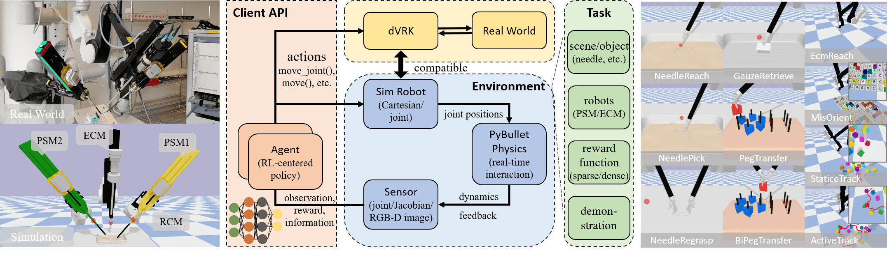

# SurRoL: یک پلتفرم منبع‌باز با تمرکز بر یادگیری تقویتی و سازگار با dVRK برای یادگیری ربات‌های جراحی

### [[وب‌سایت پروژه]](https://med-air.github.io/SurRoL/)

**ISMR'22** [ادغام هوش مصنوعی و واقعیت افزوده در جراحی رباتیک: یک مطالعه اولیه dVRK با استفاده از سناریوی آموزشی جراحی](https://arxiv.org/abs/2201.00383)  
**IROS'21** [SurRoL: یک پلتفرم منبع‌باز با تمرکز بر یادگیری تقویتی و سازگار با dVRK برای یادگیری ربات‌های جراحی](https://arxiv.org/abs/2108.13035)

<p align="center">

   

</p>

## ویژگی‌ها

- سازگاری با [ربات‌های dVRK](https://github.com/jhu-dvrk/sawIntuitiveResearchKit/wiki).  
- [API](./surrol/gym) سبک [Gym](https://github.com/openai/gym) برای یادگیری تقویتی.  
- شامل ده [وظیفه مرتبط با جراحی](./surrol/tasks).  
- دارای انواع مختلف [اشیا](./surrol/assets).  
- مبتنی بر [PyBullet](https://github.com/bulletphysics/bullet3) برای شبیه‌سازی فیزیک.  

## نصب

این پروژه روی سیستم عامل اوبونتو و با استفاده از Python 3.7،  
[PyBullet](https://github.com/bulletphysics/bullet3)،  
[Gym 0.15.6](https://github.com/openai/gym/releases/tag/0.15.6)،  
و [Baselines](https://github.com/openai/baselines)  
و همچنین با استفاده از [TensorFlow 1.14](https://www.tensorflow.org/install/pip) ارزیابی شده است.

### آماده‌سازی محیط

1. ایجاد یک محیط مجازی Conda و فعال کردن آن:
    ```shell
    conda create -n surrol python=3.7 -y
    conda activate surrol
    ```

2. نصب Gym (نسخه اصلاح‌شده)، tensorflow-gpu==1.14، و baselines (نسخه اصلاح‌شده).

### نصب SurRoL

```shell
git clone https://github.com/jiaqixuac/surrol.git
cd surrol
pip install -e .
```

## شروع به کار

API کنترل ربات از [dVRK](https://github.com/jhu-dvrk/dvrk-ros/tree/master/dvrk_python/src/dvrk) (قبل از "crtk") پیروی می‌کند، که با ربات‌های واقعی dVRK سازگار است.  

می‌توانید نگاهی به Jupyter Notebookهای موجود در [tests](./tests) بیندازید.  
چند فایل آزمایشی برای [PSM](./tests/test_psm.ipynb) و [ECM](./tests/test_ecm.ipynb) وجود دارد که شامل رویه‌های اصلی برای شروع محیط، بارگذاری ربات، و آزمایش کینماتیک هستند.  

همچنین فایل‌هایی برای اجرای [run](./run) برای ارزیابی محیط‌ها با استفاده از Baselines ارائه شده است.

## استناد

اگر این مقاله یا کد برای تحقیقات شما مفید بود، لطفاً پروژه را استناد کنید.

```
@inproceedings{xu2021surrol,
  title={SurRoL: An Open-source Reinforcement Learning Centered and dVRK Compatible Platform for Surgical Robot Learning},
  author={Xu, Jiaqi and Li, Bin and Lu, Bo and Liu, Yun-Hui and Dou, Qi and Heng, Pheng-Ann},
  booktitle={2021 IEEE/RSJ International Conference on Intelligent Robots and Systems (IROS)},
  year={2021},
  organization={IEEE}
}
```

## لایسنس

SurRoL تحت [لایسنس MIT](LICENSE) منتشر شده است.

## تقدیر و تشکر

این کد با ارجاع به پروژه‌های [dVRK](https://github.com/jhu-dvrk/sawIntuitiveResearchKit/wiki)،  
[AMBF](https://github.com/WPI-AIM/ambf)،  
[dVRL](https://github.com/ucsdarclab/dVRL)،  
[RLBench](https://github.com/stepjam/RLBench)،  
[Decentralized-MultiArm](https://github.com/columbia-ai-robotics/decentralized-multiarm)،  
[Ravens](https://github.com/google-research/ravens)، و غیره ساخته شده است.

## تماس

برای هرگونه سوال، لطفاً به <a href="mailto:qidou@cuhk.edu.hk">qidou@cuhk.edu.hk</a> ایمیل بزنید.
